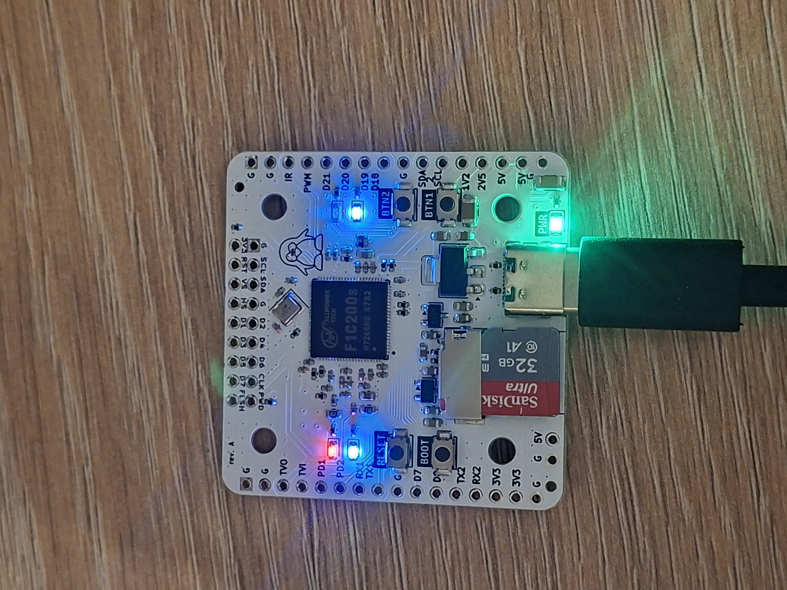
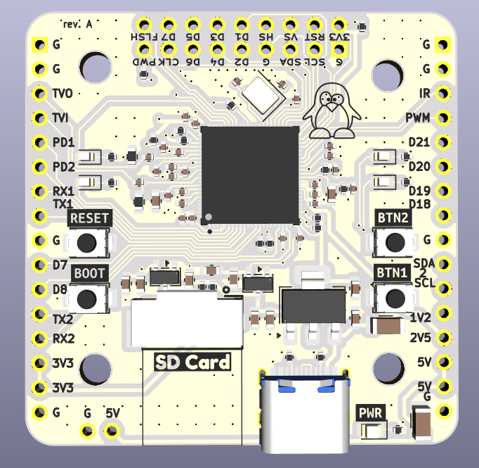

# F1C200S Dev Board

Custom PCB with the Allwinner F1C200S SoC, built to learn more about embedded Linux!

## Overview

The F1C200S is an ARM9 (ARM926EJ-S) processor with 64MB DDR1 RAM built into the package.
No external memory needed -- a 2-layer PCB is all it takes to run Linux.

## Features

- **SoC**: Allwinner F1C200S (ARM9 @ 408MHz, 64MB SiP DDR1)
- **Boot**: Micro SD card
- **USB**: USB-C (OTG + FEL mode flashing)
- **Debug**: UART0 console header, RESET and BOOT/FEL buttons
- **Power**: 5V USB input, 3x LDO regulators (3.3V, 2.5V, 1.2V)
- **Clock**: 24MHz crystal

## Broken-out peripherals

The board exposes most of the SoC's peripherals via pin headers:

- 3x UART, 3x I2C (TWI), 2x SPI, 2x PWM
- 8-bit parallel camera interface (CSI) on a 2x9 header for OV2640 breakout
- Composite video output (TVOUT)
- Built-in audio codec (headphone out, mic in, line in, FM in)
- IR receiver input
- Two 16-pin 2.54mm headers with misc GPIO and power (Port D and Port E)

## Hardware

- **EDA**: KiCad 9
- **PCB**: 2-layer
- **Assembly**: Designed for JLCPCB SMT assembly

Schematic and board files are in `F1C200S-Dev-board/`.

## Software

The `br2-external/` tree has everything needed to build a bootable SD card image with Buildroot:

- **Linux**: 6.19.11 (suniv/sun8i, custom device tree)
- **U-Boot**: 2025.01 (`licheepi_nano` defconfig + custom DTS)
- **Rootfs**: musl + BusyBox, Dropbear SSH, wpa_supplicant
- **Flashing**: `sunxi-fel` over USB

```sh
make            # clone buildroot + build everything
make kernel     # safe kernel rebuild after DTS / linux patch / fragment changes
make uboot      # safe U-Boot rebuild after U-Boot DTS / patch / config changes
make menuconfig # tweak buildroot config
```

Output: `buildroot/output/images/sdcard.img`

## Common workflows

Use these as the default rules of thumb:

| If you changed... | Rebuild with... | Deploy with... |
| --- | --- | --- |
| `src/**` userspace tools/apps | `make deploy-apps` | included in `make deploy-apps` |
| `br2-external/board/f1c200s-devboard/dts/**` | `make kernel` | `make deploy-kernel` |
| `br2-external/board/f1c200s-devboard/linux-patches/**` | `make kernel` | `make deploy-kernel` |
| `br2-external/board/f1c200s-devboard/linux.fragment` | `make kernel` | `make deploy-kernel` |
| kernel config via `make linux-menuconfig` | `make kernel` | `make deploy-kernel` |
| `br2-external/board/f1c200s-devboard/u-boot*` or U-Boot DTS/patches | `make uboot` | no network deploy target; reflash boot media |
| Buildroot defconfig / package selection | `make defconfig && make` | depends on what changed |

Notes:

- `make deploy-kernel` only installs `zImage` and `suniv-f1c200s-devboard.dtb`
  to the boot partition on the running board.
- `make deploy-apps` rebuilds and copies the userspace binaries under `src/`
  plus selected target tools like `yavta`.
- There is intentionally no `make image` target anymore. It was too fragile for
  kernel patch stack changes.

## Status

Rev A -- initial prototype



**2026-04-20**: First Linux boot! Rev A boards arrived and reached a busybox root shell
on UART0. The core path (USB-C power, DDR1, 24MHz PLL, MMC, pinctrl, UART, GPIO LEDs,
SPI) is all verified working under Linux 6.19.11. Later the same day, USB composite
gadget (CDC ECM ethernet + CDC ACM serial) came up — one USB-C cable now carries
power, a shell on `/dev/ttyACM0`, and a network link on `usb0` (192.168.100.1).
Buttons work via the input subsystem (`/dev/input/event0`) after a kernel patch
that aligns suniv's pinctrl strict-mode behaviour with other sunxi SoCs.


